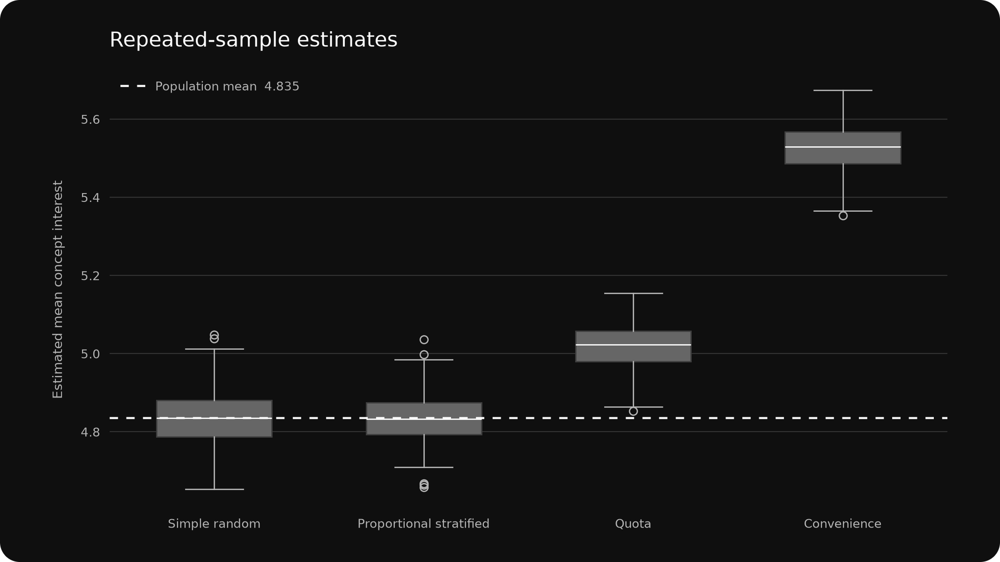
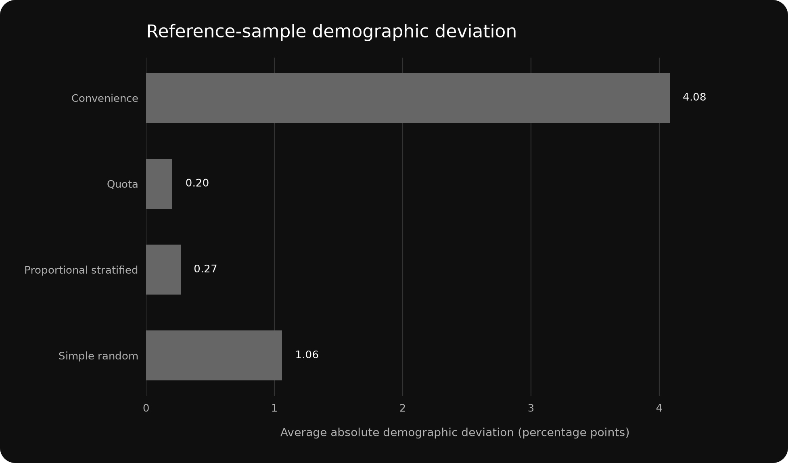

# Sampling Strategy Comparison

## Project Snapshot

| Project type | Dataset | Tools | Outputs |
|---|---|---|---|
| Simulated Quantitative Case Study | 50,000-Person Synthetic UK Adult Population | Python / Pandas / NumPy / Matplotlib | Repeated-Sample Estimates; Sampling Performance Summary; Reference Samples; Figures |

**Skills demonstrated:** Sampling · Statistical Analysis

## Study Context

This simulated case study is set within a hypothetical UK online concept survey for a fictional meal-kit subscription. A synthetic population of 50,000 adults aged 18–74 provides a known benchmark against which different sampling strategies can be evaluated.

The population proportions and behavioural relationships are entirely simulated and should not be interpreted as estimates of the real UK population. Each sampling strategy draws 800 respondents from the same synthetic population.

## Sampling Objective

The objective is to compare how sampling design affects representativeness, bias and precision when estimating concept interest from a finite population.

The primary estimand is the population mean on a 0–10 concept-interest scale. The secondary estimand is the share of the population scoring 7 or higher, treated as likely to try the concept.

## Sampling Strategies

### Simple random sampling

Every population member has the same selection probability. This provides the probability-sampling benchmark for the comparison.

### Proportional stratified sampling

The population is divided by age band and region. Sample allocation is proportional to each age-by-region stratum, with respondents selected randomly within strata.

### Quota sampling

Age-band and gender quotas reproduce the corresponding population margins, but selection within each quota cell favours more digitally engaged and urban respondents. This models a non-probability online-access mechanism that can remain biased even when visible quotas are matched.

### Convenience sampling

Selection probability increases substantially with digital engagement and urban residence. This represents an easily reached online sample without probability controls or demographic quotas.

## Population Benchmark

The synthetic population mean concept-interest score is 4.835. The population share classified as likely to try is 13.2%.

## Findings

Across 400 repeated samples per strategy, simple random and proportional stratified sampling were essentially unbiased. Proportional stratification reduced RMSE for the mean estimate by 16.8% relative to simple random sampling.

Quota sampling matched its selected demographic controls closely but still overestimated mean concept interest by +0.185 points on average. Convenience sampling produced the largest distortion, overestimating mean concept interest by +0.694 points and the likely-to-try share by +8.34 percentage points on average.

| Strategy | Average mean estimate | Mean bias | Empirical SD | RMSE | Likely-to-try bias |
|---|---:|---:|---:|---:|---:|
| Simple random | 4.834 | -0.000 | 0.071 | 0.071 | -0.05 pp |
| Proportional stratified | 4.834 | -0.001 | 0.059 | 0.059 | -0.01 pp |
| Quota | 5.019 | +0.185 | 0.057 | 0.193 | +1.99 pp |
| Convenience | 5.529 | +0.694 | 0.059 | 0.696 | +8.34 pp |

## Reference Sample

A single fixed reference draw is included to make the composition differences tangible. Demographic deviation is the average absolute percentage-point difference across age-band, gender and region categories.

| Strategy | Mean estimate | Mean error | Likely to try | Avg. demographic deviation |
|---|---:|---:|---:|---:|
| Simple random | 4.878 | +0.044 | 13.9% | 1.06 pp |
| Proportional stratified | 4.923 | +0.088 | 15.1% | 0.27 pp |
| Quota | 5.003 | +0.168 | 16.4% | 0.20 pp |
| Convenience | 5.449 | +0.614 | 19.8% | 4.08 pp |

## Interpretation

The comparison demonstrates two distinct sampling problems. Probability sampling controls selection directly, while non-probability methods can reproduce selected demographic margins without reproducing the population on variables related to the outcome.

The quota sample is the clearest example: its age and gender composition is deliberately close to the population, yet the within-quota preference for digitally engaged respondents shifts the concept-interest estimate upward. Demographic matching therefore reduces some visible imbalance but does not by itself establish representativeness.

The convenience sample performs worst because the same accessibility mechanism that determines who is easy to reach is also related to concept interest. The proportional stratified design performs best on RMSE because it preserves probability selection while controlling the age-by-region composition of every sample.

## Figures

### Repeated-sample estimates

The dashed line marks the known population mean. Probability samples remain centred close to the benchmark, while quota and convenience samples are shifted upward.

### Demographic deviation

The reference sample shows that low demographic deviation does not guarantee an unbiased outcome estimate when selection within demographic groups is non-random.

## Project Files

- [`report.md`](report.md) — this report.
- [`data/sampling_strategy_population.csv`](data/sampling_strategy_population.csv) — synthetic finite population used as the benchmark.
- [`data/sampling_strategy_codebook.csv`](data/sampling_strategy_codebook.csv) — variable definitions.
- [`data/sampling_strategy_scenario.csv`](data/sampling_strategy_scenario.csv) — scenario and simulation parameters.
- [`outputs/repeated_sample_estimates.csv`](outputs/repeated_sample_estimates.csv) — estimate from every repeated sample.
- [`outputs/sampling_performance.csv`](outputs/sampling_performance.csv) — bias, precision and RMSE summary by strategy.
- [`outputs/reference_sample_estimates.csv`](outputs/reference_sample_estimates.csv) — estimates from the fixed reference draw.
- [`outputs/reference_sample_composition.csv`](outputs/reference_sample_composition.csv) — population and reference-sample category shares.
- [`outputs/reference_samples.csv`](outputs/reference_samples.csv) — respondent rows selected in the four fixed reference samples.
- [`figures/estimate_distribution_by_strategy.png`](figures/estimate_distribution_by_strategy.png) — repeated-sample estimate distributions.
- [`figures/demographic_deviation_by_strategy.png`](figures/demographic_deviation_by_strategy.png) — reference-sample demographic deviation.
